# Workshop: Straight Lines

This page contains practice questions covering straight lines, including gradients, intercepts, sketching, and solving simultaneous equations. Click "Show Solution" to see a step-by-step guide and the final answer for each question.

Click [here](WS_NBS4107A_straightlines.pdf) to get the questions as a PDF, for printing purposes (please be mindful of the environment).

<li class="question-section">
  
Given the straight line function $y=2x+5$:

  <ol style="list-style-type: lower-alpha; padding-left: 2em;">
    <li class="question-item">
      
write down the gradient

      

        
Show Solution

        

          
The equation is in the form $y=mx+c$, where $m$ is the gradient.

          
<strong>Answer:</strong> The gradient is 2.

        

      

    </li>
    <li class="question-item">
      
the point where the line crosses the $y$-axis (the y-intercept), by substituting $x=0$ and solving for $y$

      

        
Show Solution

        

          
Set $x=0$: $y = 2(0) + 5 = 5$.

          
<strong>Answer:</strong> The y-intercept is at (0, 5).

        

      

    </li>
    <li class="question-item">
      
the point where the line crosses the $x$-axis (the x-intercept), by substituting $y=0$ and solving for $x$

      

        
Show Solution

        

          
Set $y=0$: $0 = 2x + 5 \implies -5 = 2x \implies x = -2.5$.

          
<strong>Answer:</strong> The x-intercept is at (-2.5, 0).

        

      

    </li>
    <li class="question-item">
      
make a sketch of the straight line graph

      

        
Show Solution

        

          
Draw a straight line that passes through the y-axis at (0, 5) and the x-axis at (-2.5, 0).

          

            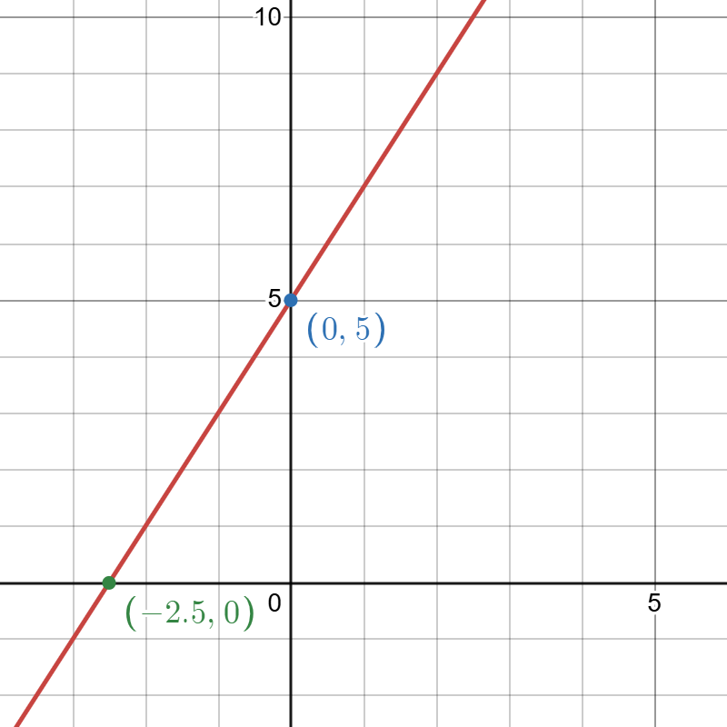
          

        

      

    </li>
  </ol>
</li>

<li class="question-section">
  
For each of the functions given:

  <ol style="list-style-type: lower-alpha; padding-left: 2em;">
      <li>Rearrange to make $y$ the subject</li>
      <li>Determine whether the function represents a straight line</li>
      <li>For straight lines: write down the value of the gradient, the co-ordinates of where the line crosses the $y$-axis, and the co-ordinates of where the line crosses the $x$-axis</li>
      <li>For straight lines: make a sketch of the function</li>
  </ol>
  <ul style="list-style-type: none; padding-left: 1em; margin-top: 1em;">
    <li class="question-item">
      
<strong>(i) $2y=6x+8$</strong>

      

Show Solution

        
a) Divide all terms by 2 to get $y=3x+4$. b) Yes, this is a straight line. c) The gradient is 3, the y-intercept is (0, 4), and the x-intercept is (-4/3, 0).

        
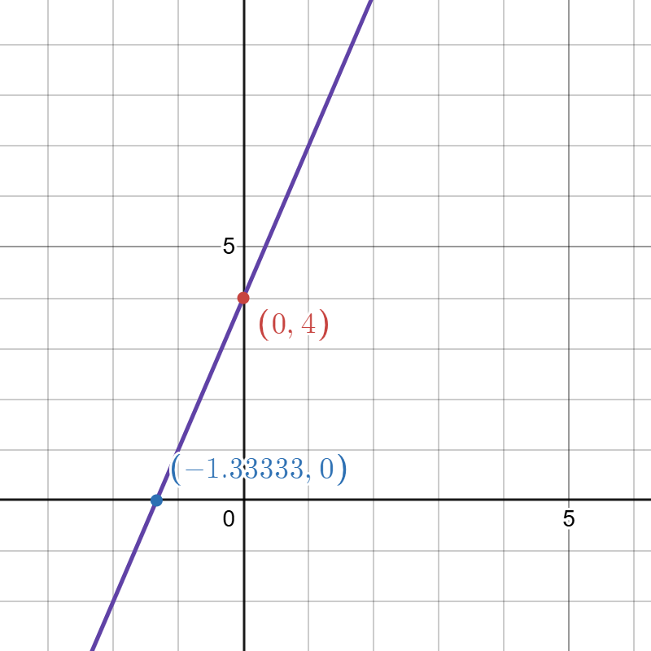

      

    </li>
    <li class="question-item">
      
<strong>(ii) $y-2x=10$</strong>

      

Show Solution

        
a) Add 2x to both sides to get $y=2x+10$. b) Yes, this is a straight line. c) The gradient is 2, the y-intercept is (0, 10), and the x-intercept is (-5, 0).

        
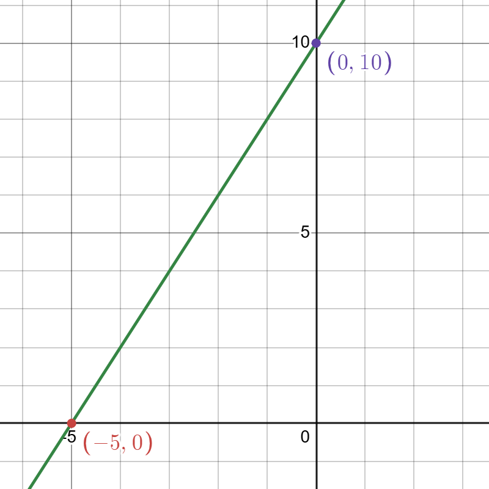

      

    </li>
    <li class="question-item">
      
<strong>(iii) $xy-5=10$</strong>

      

Show Solution

        
a) Rearrange to get $y = \frac{15}{x}$. b) No, this is not a straight line because x is in the denominator.

      

    </li>
     <li class="question-item">
      
<strong>(iv) $3x+2y-8=0$</strong>

      

Show Solution

        
a) Rearrange to get $y = -\frac{3}{2}x + 4$. b) Yes, this is a straight line. c) The gradient is -3/2, the y-intercept is (0, 4), and the x-intercept is (8/3, 0).

        
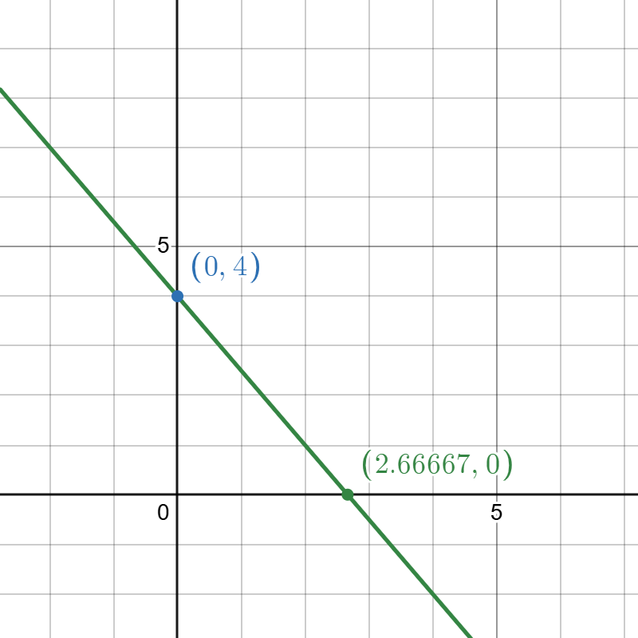

      

    </li>
     <li class="question-item">
      
<strong>(v) $x^2-3y=6$</strong>

      

Show Solution

        
a) Rearrange to get $y = \frac{x^2}{3} - 2$. b) No, the $x^2$ term means it is a parabola, not a straight line.

      

    </li>
     <li class="question-item">
      
<strong>(vi) $x^2-3y^2=6$</strong>

      

Show Solution

        
a) Rearrange to get $y = \pm\sqrt{\frac{x^2-6}{3}}$. b) No, the squared terms mean this is not a straight line.

      

    </li>
    <li class="question-item">
      
<strong>(vii) $5x-8y=9$</strong>

      

Show Solution

        
a) Rearrange to get $y = \frac{5}{8}x - \frac{9}{8}$. b) Yes, this is a straight line. c) The gradient is 5/8, the y-intercept is (0, -9/8), and the x-intercept is (9/5, 0).

        
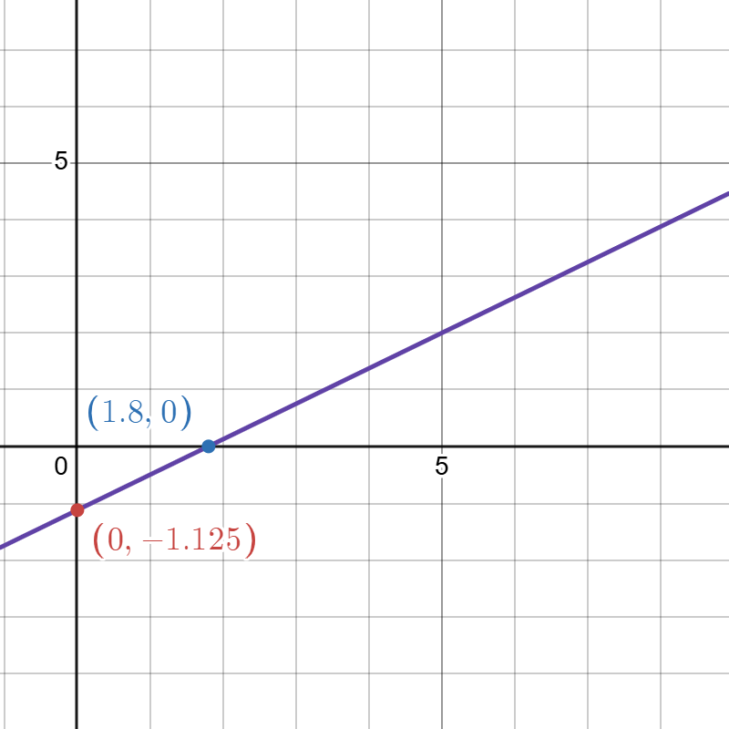

      

    </li>
    <li class="question-item">
      
<strong>(viii) $\frac{2y-x}{5}=x$</strong>

      

Show Solution

        
a) Rearrange to get $y = 3x$. b) Yes, this is a straight line. c) The gradient is 3, and it passes through the origin (0, 0).

        
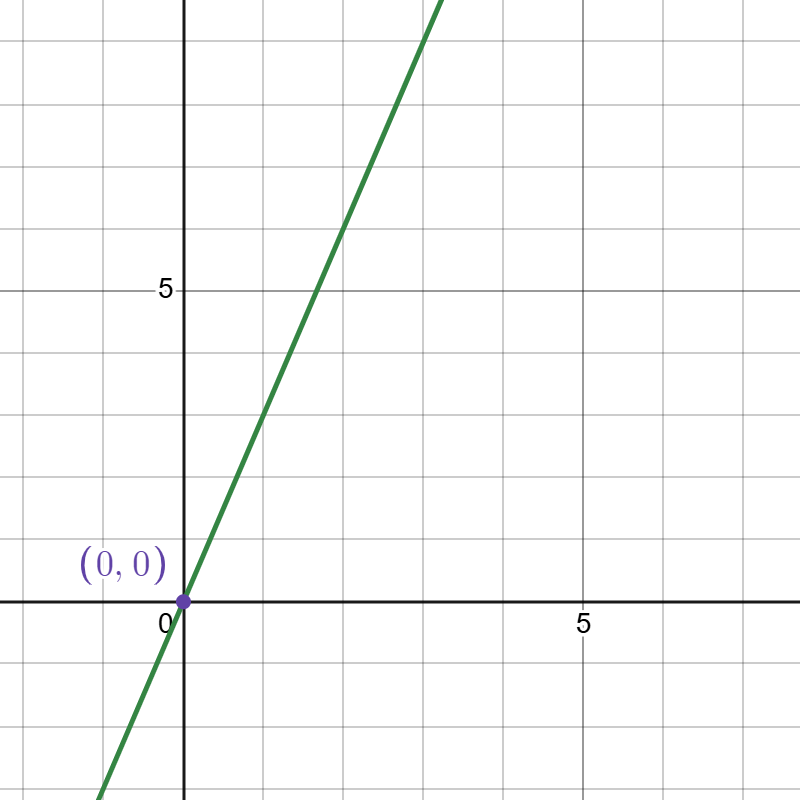

      

    </li>
    <li class="question-item">
        
<strong>(ix) $x(3y-1)=3xy+4$</strong>

        

Show Solution

            
a) Expand and simplify to get $-x=4$, or $x=-4$. b) Yes, this is a vertical straight line. c) The gradient is undefined, there is no y-intercept, and the x-intercept is (-4, 0).

            
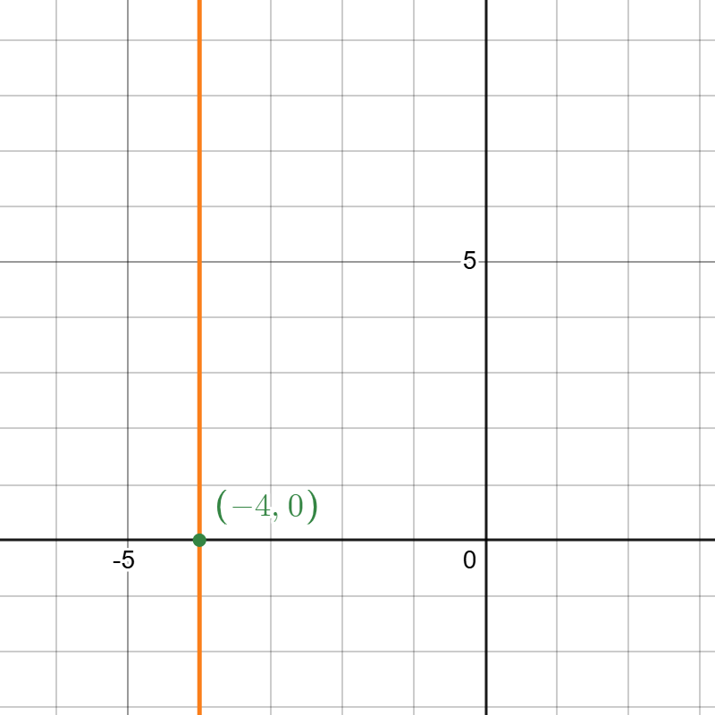

        

    </li>
  </ul>
</li>

<li class="question-section">
  
For each pair of straight lines given below:

    <ol style="list-style-type: lower-alpha; padding-left: 2em;">
      <li>Sketch each pair on a single graph, labeling the points where the lines cross the axes.</li>
      <li>Solve them as simultaneous equations.</li>
      <li>The solution is the point where the two lines cross. Label this point on your sketch.</li>
  </ol>
  <ul style="list-style-type: none; padding-left: 1em; margin-top: 1em;">
      <li class="question-item">
        
<strong>(i) $y=2x+3$ and $y=x+5$</strong>

        

Show Solution

            
b) Set equations equal: $2x+3 = x+5 \implies x=2$. Substitute back to find $y=7$. c) The intersection point is (2, 7).

            
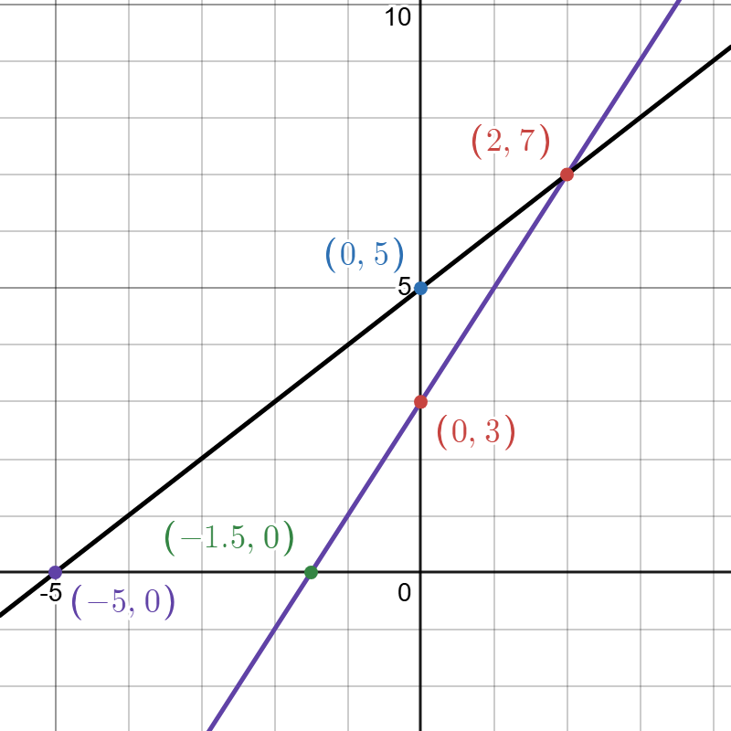

        

      </li>
      <li class="question-item">
        
<strong>(ii) $x+y=10$ and $2x-y=2$</strong>

        

Show Solution

            
b) Add equations to eliminate y: $3x=12 \implies x=4$. Substitute back to find $y=6$. c) The intersection point is (4, 6).

            
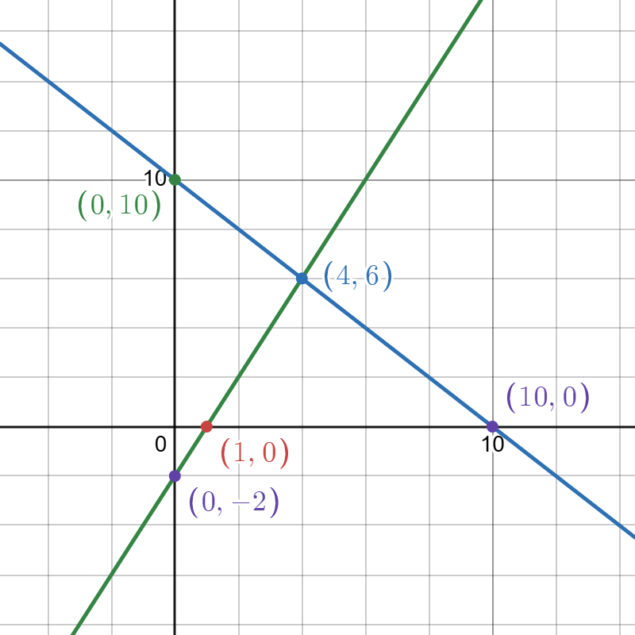

        

      </li>
  </ul>
</li>

<li class="question-section">
  

    
Sketch the supply and demand functions given. By solving the equations simultaneously, find the equilibrium price and quantity. Place Q on the horizontal axis and P on the vertical axis.

    
Supply: $P=Q+18$ Demand: $3Q=30-P$

  

  

    
Show Solution

    

      
Rearrange demand to $P=30-3Q$. Set supply equal to demand: $Q+18 = 30-3Q \implies 4Q=12 \implies Q=3$. Substitute into the supply equation to find $P = 3+18 = 21$.

      
<strong>Answer:</strong> Equilibrium is at Quantity=3, Price=21.

      

        
      

    

  

</li>

<li class="question-section">
  
A new gym charges £20 per entry (which gives the user up to 3 hours gym use).

  

    <figure class="shared-image">
      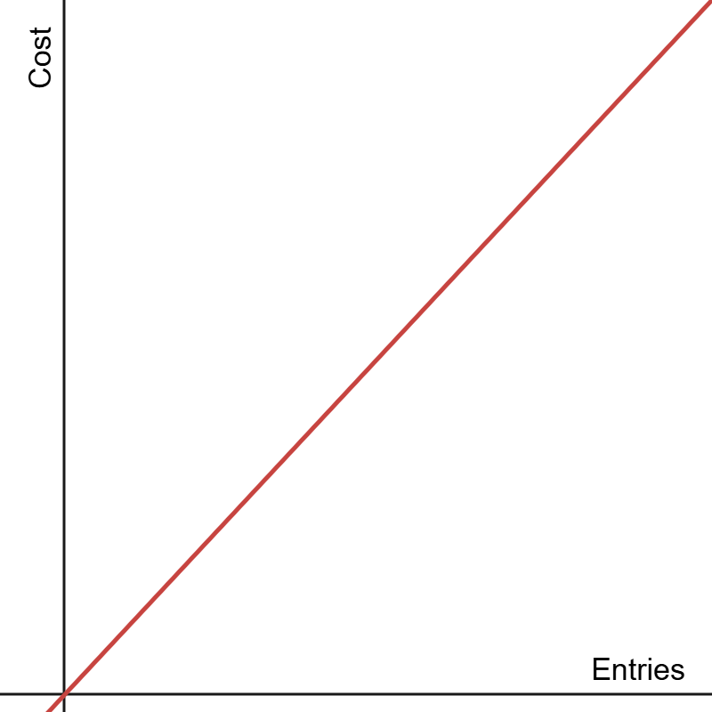
      <figcaption>Graph A</figcaption>
    </figure>
    <figure class="shared-image">
      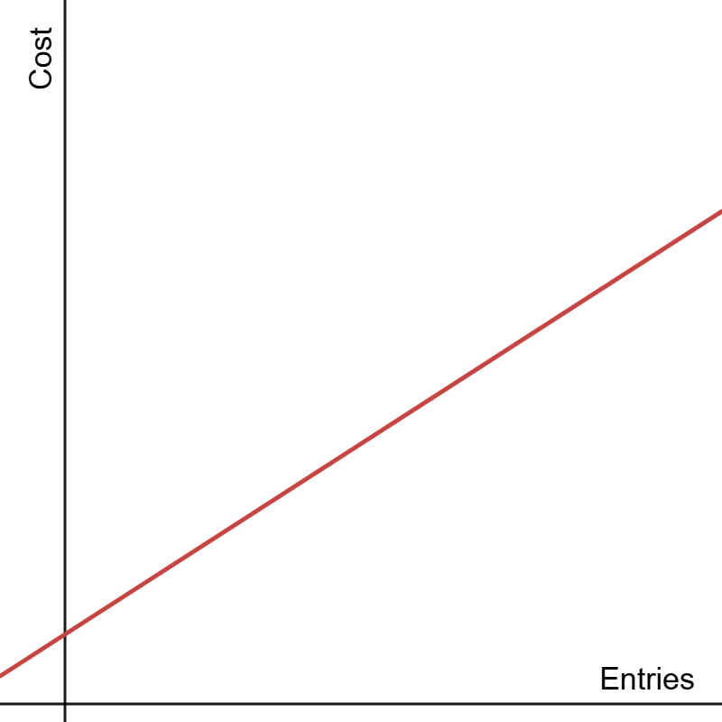
      <figcaption>Graph B</figcaption>
    </figure>
    <figure class="shared-image">
      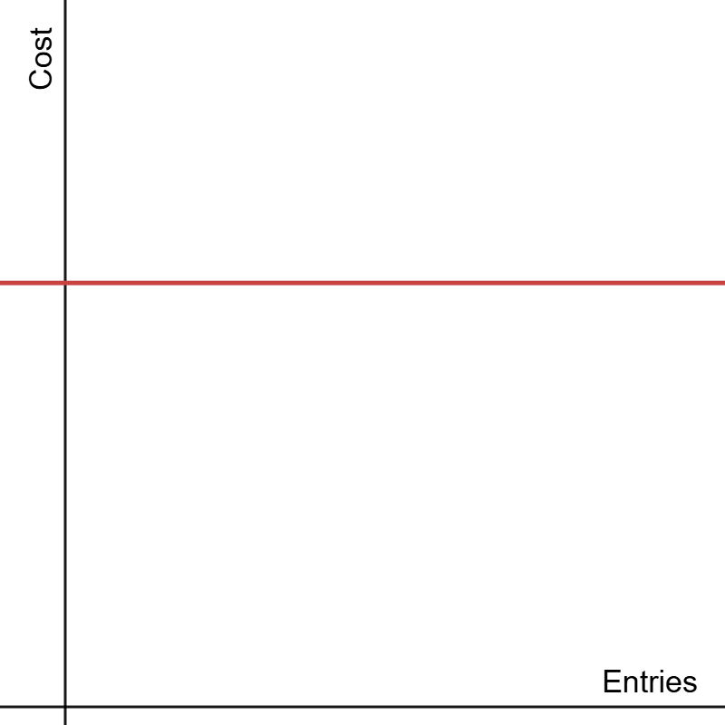
      <figcaption>Graph C</figcaption>
    </figure>
  

  <ol class="question-list" style="list-style-type: lower-alpha; padding-left: 2em;">
    <li class="question-item">
      
Which of the graphs above would best represent this?

      

Show Solution

        
This has no starting cost and a positive gradient of £20.

        
<strong>Answer:</strong> Graph A

      

    </li>
    <li class="question-item">
      
The manager also considers an alternative pricing structure. They offer a membership price of £20, and thereafter it only costs £12 per entry. Which of the graphs above would best represent this?

      

Show Solution

        
This has a starting cost of £20 (the y-intercept) and a positive gradient of £12.

        
<strong>Answer:</strong> Graph B

      

    </li>
    <li class="question-item">
      
For the unselected graph, what would be a suitable scenario for this?

      

Show Solution

        
Graph C has a zero gradient, so there is no cost per session, and a positive intercept, so a one-off cost.

        
<strong>Answer:</strong> Graph C: For example, pay a one-off fee of £60 and attend as many sessions as you like (perhaps in a given time-frame).

      

    </li>
    <li class="question-item">
      
Write down the equation of the line from part a above, using $C$ to represent cost and $E$ to represent entries, with $C$ being the subject of the equation.

      

Show Solution

<strong>Answer:</strong> $C = 20E$

    </li>
    <li class="question-item">
      
Write down the equation of the line, using the same format as d, for the line from part b above.

      

Show Solution

<strong>Answer:</strong> $C = 12E + 20$

    </li>
    <li class="question-item">
      
For each of the two pricing structures, what would be the cost of using the gym on 4 occasions?

      

Show Solution

        
Structure 1: $C = 20 \times 4 = 80$. Structure 2: $C = (12 \times 4) + 20 = 48 + 20 = 68$.

        
<strong>Answer:</strong> Structure 1: £80. Structure 2: £68.

      

    </li>
    <li class="question-item">
      
If a customer has £100, what is the maximum number of times they can attend the gym, for both pricing structures?

      

Show Solution

        
Structure 1: $100 \div 20 = 5$. Structure 2: First pay the £20 fee, leaving £80. $80 \div 12 \approx 6.67$, so 6 complete entries.

        
<strong>Answer:</strong> Structure 1: 5 times. Structure 2: 6 times.

      

    </li>
    <li class="question-item">
      
Solve the two equations simultaneously, and comment on what this would mean for the customer.

      

Show Solution

        
Set equations equal: $20E = 12E + 20 \implies 8E = 20 \implies E = 2.5$.

        
<strong>Answer:</strong> The cost is the same at 2.5 entries. For 3 or more entries, the membership structure is cheaper.

      

    </li>
  </ol>
</li>
